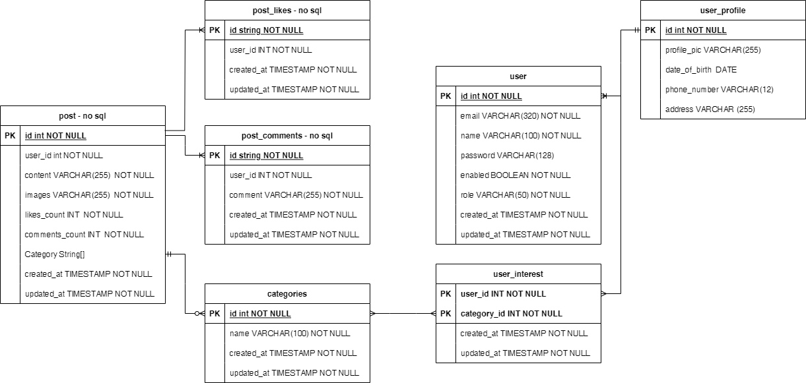

# Final Project - Banking Crowd Academy

## Minimum Viable Product (MVP)
__Epic : Crowd Academy Membership Enrollment__

1. Anyone, both SMEs/practitioners and learners can join as a trainer or learner to the academy platform using email
2. Crowd academy platform admin can see the detail of enrollment member
3. Crowd academy platform admin can approve an or multiple enrollment member
4. As a trainer or learner, they can choose which training topic/categories they want
5. As a trainer or learner, they can give/update their basic profile information

__Epic : Crowd Academy Membership Enrollment__

1. As a trainer or learner, they can see all relevant posts for their chosen categories
2. As a trainer or learner, they can see the detail of selected post
3. As a trainer or learner, they can give comment and like selected post
4. As a trainer, they can post new article related to insight/handons tutorial on particular categories

## Entity Relationship Diagram (ERD)

## Open API Documentation
View as service running at:

- http://localhost:8762/swagger-ui/index.html for user service
- http://localhost:8763/swagger-ui/index.html for post service

Or view online at:
- https://app.swaggerhub.com/apis-docs/FemiNoviaLina/final-project-banking-crowd-academy-user-service/1.0.0 for user service
- https://app.swaggerhub.com/apis-docs/FemiNoviaLina/final-project-banking-crowd-academy-post-service/v1 for post service

## High Level Architecture Diagram
